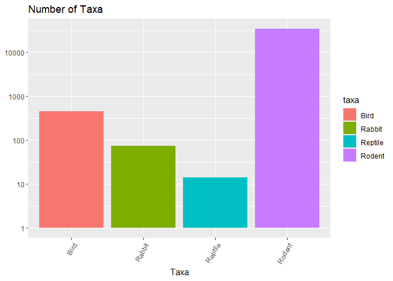
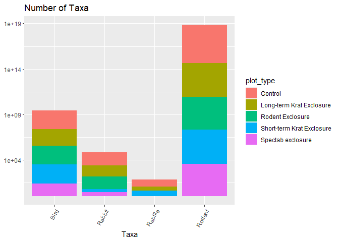
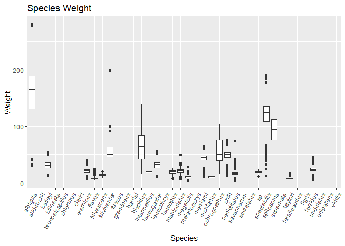
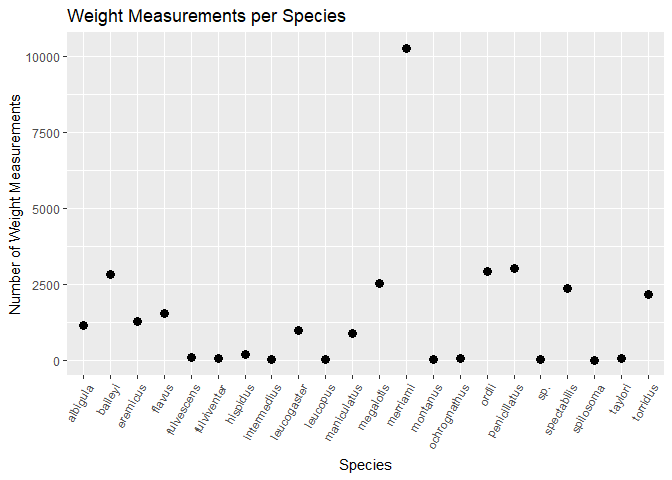
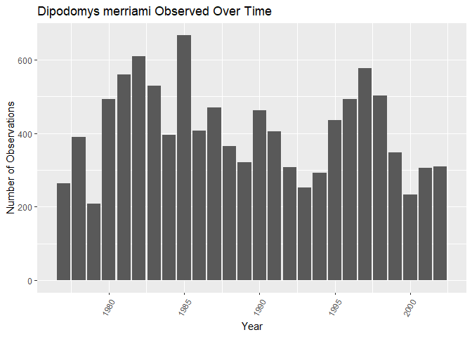
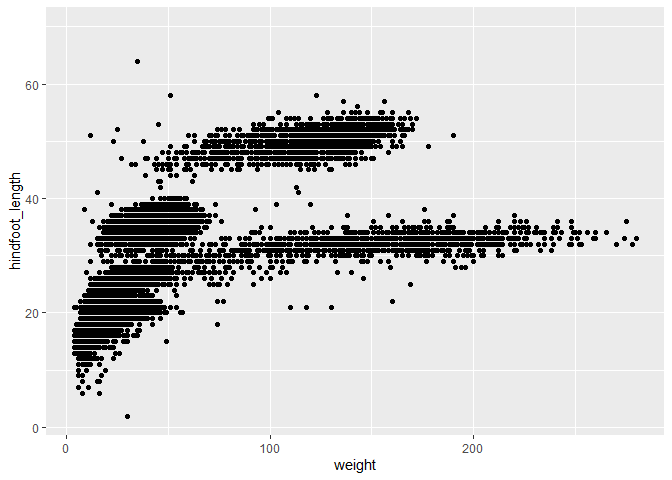
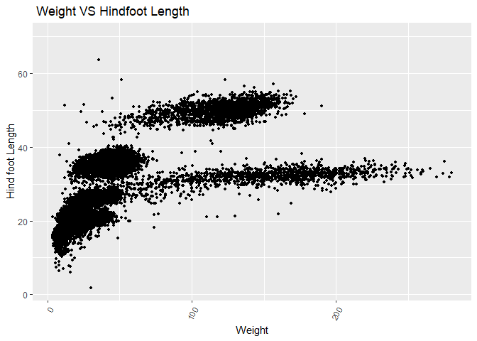
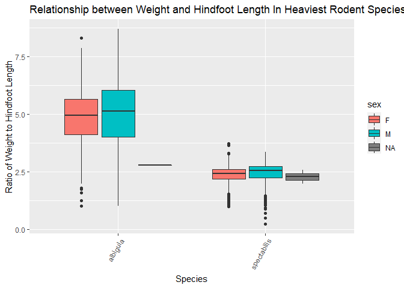
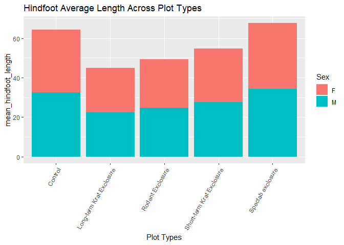

## Instructions
Answer the following questions and complete the exercises in RMarkdown. Please embed all of your code and push your final work to your repository. Your final lab report should be organized, clean, and run free from errors. Remember, you must remove the `#` for the included code chunks to run. Be sure to add your name to the author header above. For any included plots, make sure they are clearly labeled. You are free to use any plot type that you feel best communicates the results of your analysis.  

Make sure to use the formatting conventions of RMarkdown to make your report neat and clean!  

## Load the libraries

```r
library(tidyverse)
library(janitor)
library(here)
library(naniar)
```

## Desert Ecology
For this assignment, we are going to use a modified data set on [desert ecology](http://esapubs.org/archive/ecol/E090/118/). The data are from: S. K. Morgan Ernest, Thomas J. Valone, and James H. Brown. 2009. Long-term monitoring and experimental manipulation of a Chihuahuan Desert ecosystem near Portal, Arizona, USA. Ecology 90:1708.

```r
deserts <- read_csv(here("lab10", "data", "surveys_complete.csv"))
```

```
## 
## -- Column specification --------------------------------------------------------
## cols(
##   record_id = col_double(),
##   month = col_double(),
##   day = col_double(),
##   year = col_double(),
##   plot_id = col_double(),
##   species_id = col_character(),
##   sex = col_character(),
##   hindfoot_length = col_double(),
##   weight = col_double(),
##   genus = col_character(),
##   species = col_character(),
##   taxa = col_character(),
##   plot_type = col_character()
## )
```

1. Use the function(s) of your choice to get an idea of its structure, including how NA's are treated. Are the data tidy?  

_The data is tidy._

```r
str(deserts)
```

```
## tibble [34,786 x 13] (S3: spec_tbl_df/tbl_df/tbl/data.frame)
##  $ record_id      : num [1:34786] 1 2 3 4 5 6 7 8 9 10 ...
##  $ month          : num [1:34786] 7 7 7 7 7 7 7 7 7 7 ...
##  $ day            : num [1:34786] 16 16 16 16 16 16 16 16 16 16 ...
##  $ year           : num [1:34786] 1977 1977 1977 1977 1977 ...
##  $ plot_id        : num [1:34786] 2 3 2 7 3 1 2 1 1 6 ...
##  $ species_id     : chr [1:34786] "NL" "NL" "DM" "DM" ...
##  $ sex            : chr [1:34786] "M" "M" "F" "M" ...
##  $ hindfoot_length: num [1:34786] 32 33 37 36 35 14 NA 37 34 20 ...
##  $ weight         : num [1:34786] NA NA NA NA NA NA NA NA NA NA ...
##  $ genus          : chr [1:34786] "Neotoma" "Neotoma" "Dipodomys" "Dipodomys" ...
##  $ species        : chr [1:34786] "albigula" "albigula" "merriami" "merriami" ...
##  $ taxa           : chr [1:34786] "Rodent" "Rodent" "Rodent" "Rodent" ...
##  $ plot_type      : chr [1:34786] "Control" "Long-term Krat Exclosure" "Control" "Rodent Exclosure" ...
##  - attr(*, "spec")=
##   .. cols(
##   ..   record_id = col_double(),
##   ..   month = col_double(),
##   ..   day = col_double(),
##   ..   year = col_double(),
##   ..   plot_id = col_double(),
##   ..   species_id = col_character(),
##   ..   sex = col_character(),
##   ..   hindfoot_length = col_double(),
##   ..   weight = col_double(),
##   ..   genus = col_character(),
##   ..   species = col_character(),
##   ..   taxa = col_character(),
##   ..   plot_type = col_character()
##   .. )
```


```r
deserts %>% 
  naniar::miss_var_summary()
```

```
## # A tibble: 13 x 3
##    variable        n_miss pct_miss
##    <chr>            <int>    <dbl>
##  1 hindfoot_length   3348     9.62
##  2 weight            2503     7.20
##  3 sex               1748     5.03
##  4 record_id            0     0   
##  5 month                0     0   
##  6 day                  0     0   
##  7 year                 0     0   
##  8 plot_id              0     0   
##  9 species_id           0     0   
## 10 genus                0     0   
## 11 species              0     0   
## 12 taxa                 0     0   
## 13 plot_type            0     0
```

```r
head(deserts)
```

```
## # A tibble: 6 x 13
##   record_id month   day  year plot_id species_id sex   hindfoot_length weight
##       <dbl> <dbl> <dbl> <dbl>   <dbl> <chr>      <chr>           <dbl>  <dbl>
## 1         1     7    16  1977       2 NL         M                  32     NA
## 2         2     7    16  1977       3 NL         M                  33     NA
## 3         3     7    16  1977       2 DM         F                  37     NA
## 4         4     7    16  1977       7 DM         M                  36     NA
## 5         5     7    16  1977       3 DM         M                  35     NA
## 6         6     7    16  1977       1 PF         M                  14     NA
## # ... with 4 more variables: genus <chr>, species <chr>, taxa <chr>,
## #   plot_type <chr>
```


2. How many genera and species are represented in the data? What are the total number of observations? Which species is most/ least frequently sampled in the study?

_There are 26 genera and 40 species represented in these data. The most frequently sampled species is the merriami. The least frequently sampled species is a 6 way tie between clarki, scutalatus, tereticaudus, tigris, uniparens and viridis. The total number of observations is 34786._ 


```r
deserts %>% 
  group_by(genus) %>% 
  summarise(genus_total= n())
```

```
## # A tibble: 26 x 2
##    genus            genus_total
##  * <chr>                  <int>
##  1 Ammodramus                 2
##  2 Ammospermophilus         437
##  3 Amphispiza               303
##  4 Baiomys                   46
##  5 Calamospiza               13
##  6 Callipepla                16
##  7 Campylorhynchus           50
##  8 Chaetodipus             6029
##  9 Cnemidophorus              2
## 10 Crotalus                   2
## # ... with 16 more rows
```

```r
deserts %>% 
  group_by(species) %>% 
  summarise(species_total= n()) %>% 
  arrange(desc(species_total))
```

```
## # A tibble: 40 x 2
##    species      species_total
##    <chr>                <int>
##  1 merriami             10596
##  2 penicillatus          3123
##  3 ordii                 3027
##  4 baileyi               2891
##  5 megalotis             2609
##  6 spectabilis           2504
##  7 torridus              2249
##  8 flavus                1597
##  9 eremicus              1299
## 10 albigula              1252
## # ... with 30 more rows
```

```r
deserts %>% 
  summarise(observation_count=n())
```

```
## # A tibble: 1 x 1
##   observation_count
##               <int>
## 1             34786
```


3. What is the proportion of taxa included in this study? Show a table and plot that reflects this count.

```r
deserts%>%
  tabyl(taxa)
```

```
##     taxa     n      percent
##     Bird   450 0.0129362387
##   Rabbit    75 0.0021560398
##  Reptile    14 0.0004024608
##   Rodent 34247 0.9845052607
```

```r
deserts %>% 
  ggplot(aes(x=taxa, fill=taxa))+ geom_bar() +scale_y_log10()+ theme(axis.text.x = element_text(angle = 60, hjust = 1))+ labs(title = "Number of Taxa",x="Taxa", y= NULL)
```

<!-- -->

 

4. For the taxa included in the study, use the fill option to show the proportion of individuals sampled by `plot_type.`

```r
deserts %>% 
  ggplot(aes(x=taxa, fill=plot_type))+ geom_bar() +scale_y_log10()+ theme(axis.text.x = element_text(angle = 60, hjust = 1))+ labs(title = "Number of Taxa",x="Taxa", y= NULL)
```

<!-- -->


5. What is the range of weight for each species included in the study? Remove any observations of weight that are NA so they do not show up in the plot.

```r
deserts%>%
  ggplot(aes(x=species,y=weight))+ geom_boxplot(na.rm = T)+ theme(axis.text.x = element_text(angle = 60, hjust = 1))+
  labs(title = "Species Weight",x="Species",y="Weight")
```

<!-- -->

<style>
div.blue { background-color:#e6f0ff; border-radius: 5px; padding: 20px;}
</style>
<div class = "blue">

6. Add another layer to your answer from #4 using `geom_point` to get an idea of how many measurements were taken for each species.

```r
deserts%>%
  group_by(species)%>%
  filter(weight!="NA")%>%
  count(n_distinct(record_id))
```

```
## # A tibble: 22 x 3
## # Groups:   species [22]
##    species     `n_distinct(record_id)`     n
##    <chr>                         <int> <int>
##  1 albigula                      32283  1152
##  2 baileyi                       32283  2810
##  3 eremicus                      32283  1260
##  4 flavus                        32283  1548
##  5 fulvescens                    32283    75
##  6 fulviventer                   32283    41
##  7 hispidus                      32283   172
##  8 intermedius                   32283     8
##  9 leucogaster                   32283   970
## 10 leucopus                      32283    36
## # ... with 12 more rows
```

```r
deserts%>%
group_by(species)%>%
filter(weight!="NA")%>%
count(species)%>%
ggplot(aes(x=species,y=n))+
geom_point(size=3)+
theme(axis.text.x = element_text(angle = 60, hjust = 1))+
labs(title = "Weight Measurements per Species",x="Species",y="Number of Weight Measurements")
```

<!-- -->

</div>


7. [Dipodomys merriami](https://en.wikipedia.org/wiki/Merriam's_kangaroo_rat) is the most frequently sampled animal in the study. How have the number of observations of this species changed over the years included in the study?

```r
deserts%>%
  filter(species=="merriami")%>%
  ggplot(aes(x=year))+
    geom_bar()+
    theme(axis.text.x = element_text(angle = 60, hjust = 1))+
  labs(title = "Dipodomys merriami Observed Over Time",x="Year",y="Number of Observations")
```

<!-- -->


8. What is the relationship between `weight` and `hindfoot` length? Consider whether or not over plotting is an issue.

```r
deserts%>%
  ggplot(aes(x=weight,y=hindfoot_length))+
  geom_point(na.rm=T)
```

<!-- -->

```r
deserts%>%
  ggplot(aes(x=weight,y=hindfoot_length))+
  geom_jitter(na.rm = T,size=.9)+
  theme(axis.text.x = element_text(angle = 60, hjust = 1))+
  labs(title = " Weight VS Hindfoot Length",x="Weight",y="Hind foot Length")
```

<!-- -->


9. Which two species have, on average, the highest weight? Once you have identified them, make a new column that is a ratio of `weight` to `hindfoot_length`. Make a plot that shows the range of this new ratio and fill by sex.

```r
deserts%>%
  group_by(species)%>%
  summarise(avg_weight=mean(weight,na.rm=T))%>%
  arrange(desc(avg_weight))
```

```
## # A tibble: 40 x 2
##    species      avg_weight
##    <chr>             <dbl>
##  1 albigula          159. 
##  2 spectabilis       120. 
##  3 spilosoma          93.5
##  4 hispidus           65.6
##  5 fulviventer        58.9
##  6 ochrognathus       55.4
##  7 ordii              48.9
##  8 merriami           43.2
##  9 baileyi            31.7
## 10 leucogaster        31.6
## # ... with 30 more rows
```

```r
deserts2<-deserts%>%
  mutate(Weight_hindfoot_ratio=(weight/hindfoot_length))
deserts2
```

```
## # A tibble: 34,786 x 14
##    record_id month   day  year plot_id species_id sex   hindfoot_length weight
##        <dbl> <dbl> <dbl> <dbl>   <dbl> <chr>      <chr>           <dbl>  <dbl>
##  1         1     7    16  1977       2 NL         M                  32     NA
##  2         2     7    16  1977       3 NL         M                  33     NA
##  3         3     7    16  1977       2 DM         F                  37     NA
##  4         4     7    16  1977       7 DM         M                  36     NA
##  5         5     7    16  1977       3 DM         M                  35     NA
##  6         6     7    16  1977       1 PF         M                  14     NA
##  7         7     7    16  1977       2 PE         F                  NA     NA
##  8         8     7    16  1977       1 DM         M                  37     NA
##  9         9     7    16  1977       1 DM         F                  34     NA
## 10        10     7    16  1977       6 PF         F                  20     NA
## # ... with 34,776 more rows, and 5 more variables: genus <chr>, species <chr>,
## #   taxa <chr>, plot_type <chr>, Weight_hindfoot_ratio <dbl>
```

```r
deserts2%>%
  filter(species=="albigula"|species=="spectabilis")%>%
  ggplot(aes(x=species,y=Weight_hindfoot_ratio,fill=sex))+
  geom_boxplot()+
  theme(axis.text.x = element_text(angle = 60, hjust = 1))+
  labs(title = "Relationship between Weight and Hindfoot Length In Heaviest Rodent Species",x="Species",y="Ratio of Weight to Hindfoot Length")
```

```
## Warning: Removed 684 rows containing non-finite values (stat_boxplot).
```

<!-- -->


10. Make one plot of your choice! Make sure to include at least two of the aesthetics options you have learned.

```r
deserts%>%
  group_by(plot_type,sex)%>%
  filter(sex != "NA") %>% 
  summarise(mean_hindfoot_length=mean(hindfoot_length,plot_type=plot_type,na.rm=T))%>%
  ggplot(aes(x=plot_type,y=mean_hindfoot_length,fill=sex))+
  geom_col()+
  theme(axis.text.x = element_text(angle = 60, hjust = 1))+
  labs(title = "Hindfoot Average Length Across Plot Types",
       x = "Plot Types",
       Y="Average Hindfoot Length",
       fill = "Sex")
```

```
## `summarise()` has grouped output by 'plot_type'. You can override using the `.groups` argument.
```

<!-- -->


## Push your final code to GitHub!
Please be sure that you check the `keep md` file in the knit preferences. 
