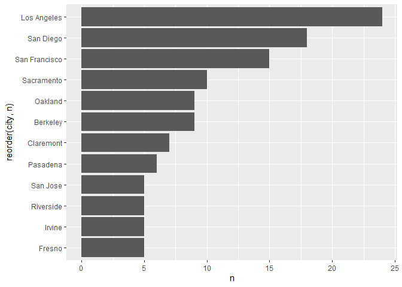
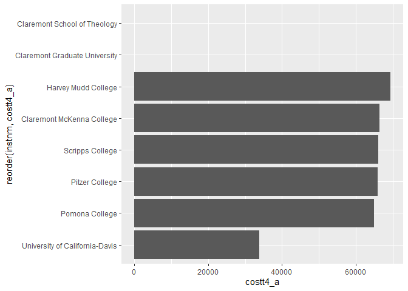
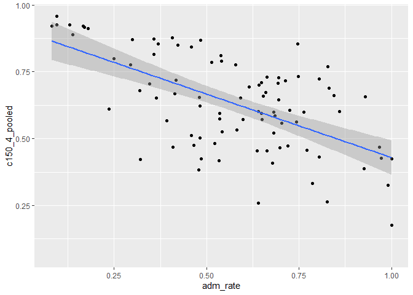
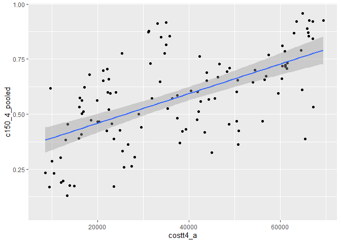
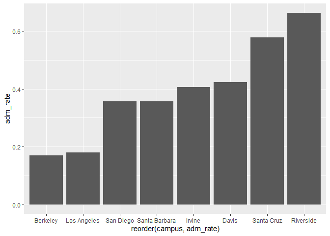
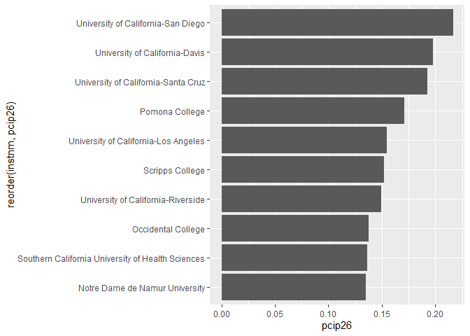

## Instructions
Answer the following questions and complete the exercises in RMarkdown. Please embed all of your code and push your final work to your repository. Your final lab report should be organized, clean, and run free from errors. Remember, you must remove the `#` for the included code chunks to run. Be sure to add your name to the author header above.  

Make sure to use the formatting conventions of RMarkdown to make your report neat and clean!  

## Load the libraries

```r
library(tidyverse)
library(janitor)
library(here)
library(naniar)
```

For this homework, we will take a departure from biological data and use data about California colleges. These data are a subset of the national college scorecard (https://collegescorecard.ed.gov/data/). Load the `ca_college_data.csv` as a new object called `colleges`.

```r
colleges<- readr::read_csv("data/ca_college_data.csv")
```

```
## Parsed with column specification:
## cols(
##   INSTNM = col_character(),
##   CITY = col_character(),
##   STABBR = col_character(),
##   ZIP = col_character(),
##   ADM_RATE = col_double(),
##   SAT_AVG = col_double(),
##   PCIP26 = col_double(),
##   COSTT4_A = col_double(),
##   C150_4_POOLED = col_double(),
##   PFTFTUG1_EF = col_double()
## )
```

The variables are a bit hard to decipher, here is a key:  

INSTNM: Institution name  
CITY: California city  
STABBR: Location state  
ZIP: Zip code  
ADM_RATE: Admission rate  
SAT_AVG: SAT average score  
PCIP26: Percentage of degrees awarded in Biological And Biomedical Sciences  
COSTT4_A: Annual cost of attendance  
C150_4_POOLED: 4-year completion rate  
PFTFTUG1_EF: Percentage of undergraduate students who are first-time, full-time degree/certificate-seeking undergraduate students  

1. Use your preferred function(s) to have a look at the data and get an idea of its structure. Make sure you summarize NA's and determine whether or not the data are tidy. You may also consider dealing with any naming issues.

```r
glimpse(colleges)
```

```
## Rows: 341
## Columns: 10
## $ INSTNM        <chr> "Grossmont College", "College of the Sequoias", "Coll...
## $ CITY          <chr> "El Cajon", "Visalia", "San Mateo", "Ventura", "Oxnar...
## $ STABBR        <chr> "CA", "CA", "CA", "CA", "CA", "CA", "CA", "CA", "CA",...
## $ ZIP           <chr> "92020-1799", "93277-2214", "94402-3784", "93003-3872...
## $ ADM_RATE      <dbl> NA, NA, NA, NA, NA, NA, NA, NA, NA, NA, NA, NA, NA, N...
## $ SAT_AVG       <dbl> NA, NA, NA, NA, NA, NA, NA, NA, NA, NA, NA, NA, NA, N...
## $ PCIP26        <dbl> 0.0016, 0.0066, 0.0038, 0.0035, 0.0085, 0.0151, 0.000...
## $ COSTT4_A      <dbl> 7956, 8109, 8278, 8407, 8516, 8577, 8580, 9181, 9281,...
## $ C150_4_POOLED <dbl> NA, NA, NA, NA, NA, NA, 0.2334, NA, NA, NA, NA, 0.170...
## $ PFTFTUG1_EF   <dbl> 0.3546, 0.5413, 0.3567, 0.3824, 0.2753, 0.4286, 0.230...
```


```r
colleges%>%
  naniar::miss_var_summary()
```

```
## # A tibble: 10 x 3
##    variable      n_miss pct_miss
##    <chr>          <int>    <dbl>
##  1 SAT_AVG          276     80.9
##  2 ADM_RATE         240     70.4
##  3 C150_4_POOLED    221     64.8
##  4 COSTT4_A         124     36.4
##  5 PFTFTUG1_EF       53     15.5
##  6 PCIP26            35     10.3
##  7 INSTNM             0      0  
##  8 CITY               0      0  
##  9 STABBR             0      0  
## 10 ZIP                0      0
```


```r
colleges_clean<-colleges%>%
  janitor::clean_names()
colleges_clean
```

```
## # A tibble: 341 x 10
##    instnm city  stabbr zip   adm_rate sat_avg pcip26 costt4_a c150_4_pooled
##    <chr>  <chr> <chr>  <chr>    <dbl>   <dbl>  <dbl>    <dbl>         <dbl>
##  1 Gross~ El C~ CA     9202~       NA      NA 0.0016     7956        NA    
##  2 Colle~ Visa~ CA     9327~       NA      NA 0.0066     8109        NA    
##  3 Colle~ San ~ CA     9440~       NA      NA 0.0038     8278        NA    
##  4 Ventu~ Vent~ CA     9300~       NA      NA 0.0035     8407        NA    
##  5 Oxnar~ Oxna~ CA     9303~       NA      NA 0.0085     8516        NA    
##  6 Moorp~ Moor~ CA     9302~       NA      NA 0.0151     8577        NA    
##  7 Skyli~ San ~ CA     9406~       NA      NA 0          8580         0.233
##  8 Glend~ Glen~ CA     9120~       NA      NA 0.002      9181        NA    
##  9 Citru~ Glen~ CA     9174~       NA      NA 0.0021     9281        NA    
## 10 Fresn~ Fres~ CA     93741       NA      NA 0.0324     9370        NA    
## # ... with 331 more rows, and 1 more variable: pftftug1_ef <dbl>
```

2. Which cities in California have the highest number of colleges?

_LA has the highest number of colleges._

```r
names(colleges_clean)
```

```
##  [1] "instnm"        "city"          "stabbr"        "zip"          
##  [5] "adm_rate"      "sat_avg"       "pcip26"        "costt4_a"     
##  [9] "c150_4_pooled" "pftftug1_ef"
```


```r
colleges_clean %>% 
  select(city) %>% 
  count(city) %>% 
  arrange(desc(n))
```

```
## # A tibble: 161 x 2
##    city              n
##    <chr>         <int>
##  1 Los Angeles      24
##  2 San Diego        18
##  3 San Francisco    15
##  4 Sacramento       10
##  5 Berkeley          9
##  6 Oakland           9
##  7 Claremont         7
##  8 Pasadena          6
##  9 Fresno            5
## 10 Irvine            5
## # ... with 151 more rows
```

3. Based on your answer to #2, make a plot that shows the number of colleges in the top 10 cities.

```r
colleges_clean %>% 
  select(city) %>% 
  count(city) %>% 
  arrange(desc(n))%>% 
  top_n(10,n) %>% 
  ggplot(aes(x=reorder(city,n), y=n)) +geom_col() +coord_flip()
```

<!-- -->

4. The column `COSTT4_A` is the annual cost of each institution. Which city has the highest average cost? Where is it located?

_Claremont has the highest average cost._

```r
colleges_clean %>% 
  group_by(city) %>% 
  summarise(max_cost= mean(costt4_a, na.rm=T)) %>% 
  arrange(desc(max_cost))
```

```
## `summarise()` ungrouping output (override with `.groups` argument)
```

```
## # A tibble: 161 x 2
##    city                max_cost
##    <chr>                  <dbl>
##  1 Claremont              66498
##  2 Malibu                 66152
##  3 Valencia               64686
##  4 Orange                 64501
##  5 Redlands               61542
##  6 Moraga                 61095
##  7 Atherton               56035
##  8 Thousand Oaks          54373
##  9 Rancho Palos Verdes    50758
## 10 La Verne               50603
## # ... with 151 more rows
```

5. Based on your answer to #4, make a plot that compares the cost of the individual colleges in the most expensive city. Bonus! Add UC Davis here to see how it compares :>).

```r
colleges_clean %>% 
  filter(city== "Claremont"|city== "Davis") %>% 
  select(instnm, costt4_a) %>% 
  ggplot(aes(x=reorder(instnm,costt4_a), y=costt4_a)) + geom_col()+ coord_flip()
```

```
## Warning: Removed 2 rows containing missing values (position_stack).
```

<!-- -->

6. The column `ADM_RATE` is the admissions rate by college and `C150_4_POOLED` is the four-year completion rate. Use a scatterplot to show the relationship between these two variables. What do you think this means?

_It looks like there is a negative correlation between the two variables, suggesting that the higher the admission rate, the lower the 4 year completion rate. The decreased selectivity of the college could lead to the enrollment of students with a record of poor academic performance. These students might continue to perform the same way when they enter college._

```r
colleges_clean %>% 
  ggplot(aes(x=adm_rate,y=c150_4_pooled))+ geom_point()+ geom_smooth(method = lm,se=T)
```

```
## `geom_smooth()` using formula 'y ~ x'
```

```
## Warning: Removed 251 rows containing non-finite values (stat_smooth).
```

```
## Warning: Removed 251 rows containing missing values (geom_point).
```

<!-- -->

7. Is there a relationship between cost and four-year completion rate? (You don't need to do the stats, just produce a plot). What do you think this means?

_There is a positive correlation between cost and 4 year completion rate. This could mean that paying more money for an education will motivate students to work harder to graduate, or that schools which charge more will do more to get their students to graduate. I suspect the latter is more accurate._

```r
names(colleges_clean)
```

```
##  [1] "instnm"        "city"          "stabbr"        "zip"          
##  [5] "adm_rate"      "sat_avg"       "pcip26"        "costt4_a"     
##  [9] "c150_4_pooled" "pftftug1_ef"
```


```r
colleges_clean %>% 
  ggplot(aes(x=costt4_a, y=c150_4_pooled)) +geom_point() +geom_smooth(method = lm,se=T)
```

```
## `geom_smooth()` using formula 'y ~ x'
```

```
## Warning: Removed 225 rows containing non-finite values (stat_smooth).
```

```
## Warning: Removed 225 rows containing missing values (geom_point).
```

<!-- -->

8. The column titled `INSTNM` is the institution name. We are only interested in the University of California colleges. Make a new data frame that is restricted to UC institutions. You can remove `Hastings College of Law` and `UC San Francisco` as we are only interested in undergraduate institutions.

```r
colleges_clean %>% 
  filter(str_detect(instnm,"University of California"))
```

```
## # A tibble: 10 x 10
##    instnm city  stabbr zip   adm_rate sat_avg pcip26 costt4_a c150_4_pooled
##    <chr>  <chr> <chr>  <chr>    <dbl>   <dbl>  <dbl>    <dbl>         <dbl>
##  1 Unive~ La J~ CA     92093    0.357    1324  0.216    31043         0.872
##  2 Unive~ Irvi~ CA     92697    0.406    1206  0.107    31198         0.876
##  3 Unive~ Rive~ CA     92521    0.663    1078  0.149    31494         0.73 
##  4 Unive~ Los ~ CA     9009~    0.180    1334  0.155    33078         0.911
##  5 Unive~ Davis CA     9561~    0.423    1218  0.198    33904         0.850
##  6 Unive~ Sant~ CA     9506~    0.578    1201  0.193    34608         0.776
##  7 Unive~ Berk~ CA     94720    0.169    1422  0.105    34924         0.916
##  8 Unive~ Sant~ CA     93106    0.358    1281  0.108    34998         0.816
##  9 Unive~ San ~ CA     9410~   NA          NA NA           NA        NA    
## 10 Unive~ San ~ CA     9414~   NA          NA NA           NA        NA    
## # ... with 1 more variable: pftftug1_ef <dbl>
```

Remove `Hastings College of Law` and `UC San Francisco` and store the final data frame as a new object `univ_calif_final`.

```r
univ_calif_final<- colleges_clean %>% 
  filter(str_detect(instnm,"University of California")) %>% 
  filter(instnm != "University of California-San Francisco") %>% 
  filter(instnm != "University of California-Hastings College of Law")
univ_calif_final
```

```
## # A tibble: 8 x 10
##   instnm city  stabbr zip   adm_rate sat_avg pcip26 costt4_a c150_4_pooled
##   <chr>  <chr> <chr>  <chr>    <dbl>   <dbl>  <dbl>    <dbl>         <dbl>
## 1 Unive~ La J~ CA     92093    0.357    1324  0.216    31043         0.872
## 2 Unive~ Irvi~ CA     92697    0.406    1206  0.107    31198         0.876
## 3 Unive~ Rive~ CA     92521    0.663    1078  0.149    31494         0.73 
## 4 Unive~ Los ~ CA     9009~    0.180    1334  0.155    33078         0.911
## 5 Unive~ Davis CA     9561~    0.423    1218  0.198    33904         0.850
## 6 Unive~ Sant~ CA     9506~    0.578    1201  0.193    34608         0.776
## 7 Unive~ Berk~ CA     94720    0.169    1422  0.105    34924         0.916
## 8 Unive~ Sant~ CA     93106    0.358    1281  0.108    34998         0.816
## # ... with 1 more variable: pftftug1_ef <dbl>
```

Use `separate()` to separate institution name into two new columns "UNIV" and "CAMPUS".

```r
univ_calif_final2<- univ_calif_final %>% 
  separate(instnm, into = c("univ", "campus"), "-")
univ_calif_final2
```

```
## # A tibble: 8 x 11
##   univ  campus city  stabbr zip   adm_rate sat_avg pcip26 costt4_a c150_4_pooled
##   <chr> <chr>  <chr> <chr>  <chr>    <dbl>   <dbl>  <dbl>    <dbl>         <dbl>
## 1 Univ~ San D~ La J~ CA     92093    0.357    1324  0.216    31043         0.872
## 2 Univ~ Irvine Irvi~ CA     92697    0.406    1206  0.107    31198         0.876
## 3 Univ~ River~ Rive~ CA     92521    0.663    1078  0.149    31494         0.73 
## 4 Univ~ Los A~ Los ~ CA     9009~    0.180    1334  0.155    33078         0.911
## 5 Univ~ Davis  Davis CA     9561~    0.423    1218  0.198    33904         0.850
## 6 Univ~ Santa~ Sant~ CA     9506~    0.578    1201  0.193    34608         0.776
## 7 Univ~ Berke~ Berk~ CA     94720    0.169    1422  0.105    34924         0.916
## 8 Univ~ Santa~ Sant~ CA     93106    0.358    1281  0.108    34998         0.816
## # ... with 1 more variable: pftftug1_ef <dbl>
```

9. The column `ADM_RATE` is the admissions rate by campus. Which UC has the lowest and highest admissions rates? Produce a numerical summary and an appropriate plot.

_Berkeley has the lowest admissions rate at 16.93%, while Riverside has the highest at 66.34%._

```r
univ_calif_final2 %>% 
  select(campus, adm_rate) %>% 
  group_by(adm_rate) %>% 
  arrange(desc(adm_rate))
```

```
## # A tibble: 8 x 2
## # Groups:   adm_rate [8]
##   campus        adm_rate
##   <chr>            <dbl>
## 1 Riverside        0.663
## 2 Santa Cruz       0.578
## 3 Davis            0.423
## 4 Irvine           0.406
## 5 Santa Barbara    0.358
## 6 San Diego        0.357
## 7 Los Angeles      0.180
## 8 Berkeley         0.169
```


```r
univ_calif_final2 %>% 
  select(campus, adm_rate) %>% 
  group_by(adm_rate) %>% 
  arrange(desc(adm_rate)) %>% 
  ggplot(aes(x=reorder(campus,adm_rate), y=adm_rate)) +geom_col() 
```

<!-- -->


10. If you wanted to get a degree in biological or biomedical sciences, which campus confers the majority of these degrees? Produce a numerical summary and an appropriate plot.

_San Diego confers the majority of degrees in biological or biomedical sciences at 21.65 %. Davis is a close second at 19.75%!_

```r
colleges_clean %>% 
  select(instnm, pcip26) %>% 
  group_by(pcip26) %>% 
  arrange(desc(pcip26))
```

```
## # A tibble: 341 x 2
## # Groups:   pcip26 [129]
##    instnm                                            pcip26
##    <chr>                                              <dbl>
##  1 University of California-San Diego                 0.216
##  2 University of California-Davis                     0.198
##  3 University of California-Santa Cruz                0.193
##  4 Pomona College                                     0.171
##  5 University of California-Los Angeles               0.155
##  6 Scripps College                                    0.152
##  7 University of California-Riverside                 0.149
##  8 Occidental College                                 0.137
##  9 Southern California University of Health Sciences  0.136
## 10 Notre Dame de Namur University                     0.135
## # ... with 331 more rows
```


```r
colleges_clean %>% 
  select(instnm, pcip26) %>% 
  top_n(10,pcip26)%>%
  group_by(pcip26) %>% 
  arrange(desc(pcip26)) %>% 
  ggplot(aes(x=reorder(instnm,pcip26), y=pcip26)) +geom_col()+ coord_flip()
```

<!-- -->

## Knit Your Output and Post to [GitHub](https://github.com/FRS417-DataScienceBiologists)
