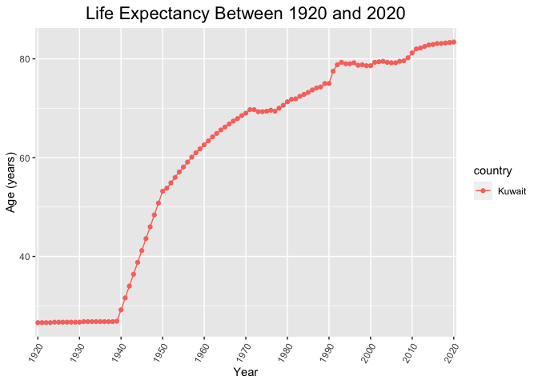
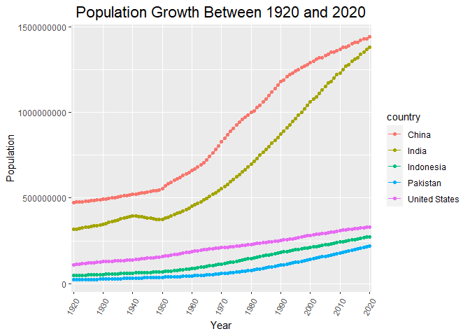
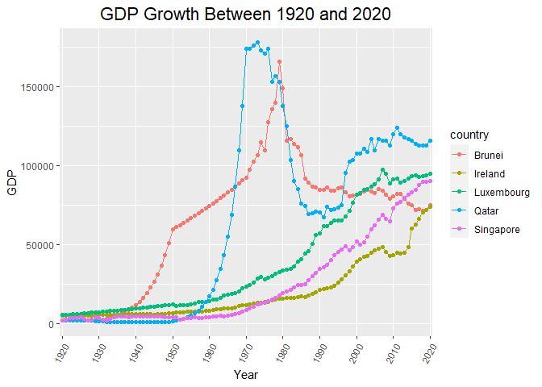
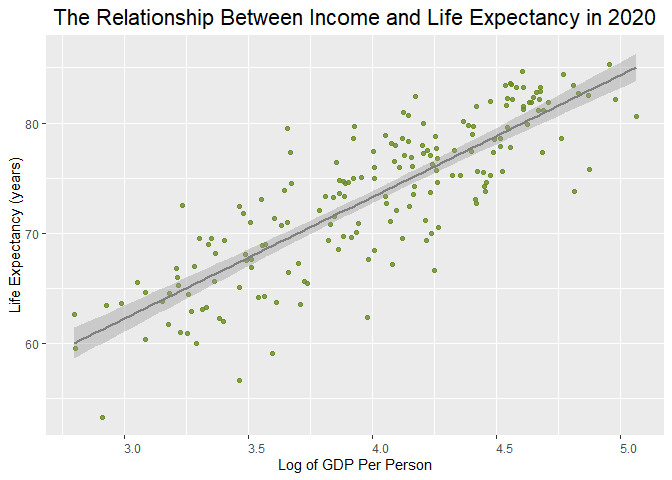

## Instructions
Answer the following questions and complete the exercises in RMarkdown. Please embed all of your code and push your final work to your repository. Your code should be organized, clean, and run free from errors. Be sure to **add your name** to the author header above. You may use any resources to answer these questions (including each other), but you may not post questions to Open Stacks or external help sites. There are 10 total questions.  

Make sure to use the formatting conventions of RMarkdown to make your report neat and clean! Your plots should use consistent aesthetics throughout. Feel free to be creative- there are many possible solutions to these questions!  

This exam is due by **12:00p on Tuesday, February 23**.  

## Load the libraries

```r
library(tidyverse)
```

```
## -- Attaching packages --------------------------------------- tidyverse 1.3.0 --
```

```
## v ggplot2 3.3.3     v purrr   0.3.4
## v tibble  3.0.3     v dplyr   1.0.2
## v tidyr   1.1.2     v stringr 1.4.0
## v readr   1.3.1     v forcats 0.5.1
```

```
## -- Conflicts ------------------------------------------ tidyverse_conflicts() --
## x dplyr::filter() masks stats::filter()
## x dplyr::lag()    masks stats::lag()
```

```r
library(janitor)
```

```
## 
## Attaching package: 'janitor'
```

```
## The following objects are masked from 'package:stats':
## 
##     chisq.test, fisher.test
```

```r
library(here)
```

```
## here() starts at C:/Users/19257/Desktop/BIS15W2021_zroland
```

```r
options(scipen=999) #disables scientific notation when printing
```

## Gapminder
For this assignment, we are going to use data from  [gapminder](https://www.gapminder.org/). Gapminder includes information about economics, population, social issues, and life expectancy from countries all over the world. We will use three data sets, so please load all three.  

One thing to note is that the data include years beyond 2021. These are projections based on modeling done by the gapminder organization. Start by importing the data.

```r
population <- read_csv("data/population_total.csv")
```

```
## Parsed with column specification:
## cols(
##   .default = col_double(),
##   country = col_character()
## )
```

```
## See spec(...) for full column specifications.
```

```r
population
```

```
## # A tibble: 195 x 302
##    country `1800` `1801` `1802` `1803` `1804` `1805` `1806` `1807` `1808` `1809`
##    <chr>    <dbl>  <dbl>  <dbl>  <dbl>  <dbl>  <dbl>  <dbl>  <dbl>  <dbl>  <dbl>
##  1 Afghan~ 3.28e6 3.28e6 3.28e6 3.28e6 3.28e6 3.28e6 3.28e6 3.28e6 3.28e6 3.28e6
##  2 Albania 4.00e5 4.02e5 4.04e5 4.05e5 4.07e5 4.09e5 4.11e5 4.13e5 4.14e5 4.16e5
##  3 Algeria 2.50e6 2.51e6 2.52e6 2.53e6 2.54e6 2.55e6 2.56e6 2.56e6 2.57e6 2.58e6
##  4 Andorra 2.65e3 2.65e3 2.65e3 2.65e3 2.65e3 2.65e3 2.65e3 2.65e3 2.65e3 2.65e3
##  5 Angola  1.57e6 1.57e6 1.57e6 1.57e6 1.57e6 1.57e6 1.57e6 1.57e6 1.57e6 1.57e6
##  6 Antigu~ 3.70e4 3.70e4 3.70e4 3.70e4 3.70e4 3.70e4 3.70e4 3.70e4 3.70e4 3.70e4
##  7 Argent~ 5.34e5 5.20e5 5.06e5 4.92e5 4.79e5 4.66e5 4.53e5 4.41e5 4.29e5 4.17e5
##  8 Armenia 4.13e5 4.13e5 4.13e5 4.13e5 4.13e5 4.13e5 4.13e5 4.13e5 4.13e5 4.13e5
##  9 Austra~ 2.00e5 2.05e5 2.11e5 2.16e5 2.22e5 2.27e5 2.33e5 2.39e5 2.46e5 2.52e5
## 10 Austria 3.00e6 3.02e6 3.04e6 3.05e6 3.07e6 3.09e6 3.11e6 3.12e6 3.14e6 3.16e6
## # ... with 185 more rows, and 291 more variables: `1810` <dbl>, `1811` <dbl>,
## #   `1812` <dbl>, `1813` <dbl>, `1814` <dbl>, `1815` <dbl>, `1816` <dbl>,
## #   `1817` <dbl>, `1818` <dbl>, `1819` <dbl>, `1820` <dbl>, `1821` <dbl>,
## #   `1822` <dbl>, `1823` <dbl>, `1824` <dbl>, `1825` <dbl>, `1826` <dbl>,
## #   `1827` <dbl>, `1828` <dbl>, `1829` <dbl>, `1830` <dbl>, `1831` <dbl>,
## #   `1832` <dbl>, `1833` <dbl>, `1834` <dbl>, `1835` <dbl>, `1836` <dbl>,
## #   `1837` <dbl>, `1838` <dbl>, `1839` <dbl>, `1840` <dbl>, `1841` <dbl>,
## #   `1842` <dbl>, `1843` <dbl>, `1844` <dbl>, `1845` <dbl>, `1846` <dbl>,
## #   `1847` <dbl>, `1848` <dbl>, `1849` <dbl>, `1850` <dbl>, `1851` <dbl>,
## #   `1852` <dbl>, `1853` <dbl>, `1854` <dbl>, `1855` <dbl>, `1856` <dbl>,
## #   `1857` <dbl>, `1858` <dbl>, `1859` <dbl>, `1860` <dbl>, `1861` <dbl>,
## #   `1862` <dbl>, `1863` <dbl>, `1864` <dbl>, `1865` <dbl>, `1866` <dbl>,
## #   `1867` <dbl>, `1868` <dbl>, `1869` <dbl>, `1870` <dbl>, `1871` <dbl>,
## #   `1872` <dbl>, `1873` <dbl>, `1874` <dbl>, `1875` <dbl>, `1876` <dbl>,
## #   `1877` <dbl>, `1878` <dbl>, `1879` <dbl>, `1880` <dbl>, `1881` <dbl>,
## #   `1882` <dbl>, `1883` <dbl>, `1884` <dbl>, `1885` <dbl>, `1886` <dbl>,
## #   `1887` <dbl>, `1888` <dbl>, `1889` <dbl>, `1890` <dbl>, `1891` <dbl>,
## #   `1892` <dbl>, `1893` <dbl>, `1894` <dbl>, `1895` <dbl>, `1896` <dbl>,
## #   `1897` <dbl>, `1898` <dbl>, `1899` <dbl>, `1900` <dbl>, `1901` <dbl>,
## #   `1902` <dbl>, `1903` <dbl>, `1904` <dbl>, `1905` <dbl>, `1906` <dbl>,
## #   `1907` <dbl>, `1908` <dbl>, `1909` <dbl>, ...
```


```r
income <- read_csv("data/income_per_person_gdppercapita_ppp_inflation_adjusted.csv")
```

```
## Parsed with column specification:
## cols(
##   .default = col_double(),
##   country = col_character()
## )
```

```
## See spec(...) for full column specifications.
```

```r
income
```

```
## # A tibble: 193 x 242
##    country `1800` `1801` `1802` `1803` `1804` `1805` `1806` `1807` `1808` `1809`
##    <chr>    <dbl>  <dbl>  <dbl>  <dbl>  <dbl>  <dbl>  <dbl>  <dbl>  <dbl>  <dbl>
##  1 Afghan~    603    603    603    603    603    603    603    603    603    603
##  2 Albania    667    667    667    667    667    668    668    668    668    668
##  3 Algeria    715    716    717    718    719    720    721    722    723    724
##  4 Andorra   1200   1200   1200   1200   1210   1210   1210   1210   1220   1220
##  5 Angola     618    620    623    626    628    631    634    637    640    642
##  6 Antigu~    757    757    757    757    757    757    757    758    758    758
##  7 Argent~   1640   1640   1650   1650   1660   1660   1670   1680   1680   1690
##  8 Armenia    514    514    514    514    514    514    514    514    514    514
##  9 Austra~    817    822    826    831    836    841    845    850    855    860
## 10 Austria   1850   1850   1860   1870   1880   1880   1890   1900   1910   1920
## # ... with 183 more rows, and 231 more variables: `1810` <dbl>, `1811` <dbl>,
## #   `1812` <dbl>, `1813` <dbl>, `1814` <dbl>, `1815` <dbl>, `1816` <dbl>,
## #   `1817` <dbl>, `1818` <dbl>, `1819` <dbl>, `1820` <dbl>, `1821` <dbl>,
## #   `1822` <dbl>, `1823` <dbl>, `1824` <dbl>, `1825` <dbl>, `1826` <dbl>,
## #   `1827` <dbl>, `1828` <dbl>, `1829` <dbl>, `1830` <dbl>, `1831` <dbl>,
## #   `1832` <dbl>, `1833` <dbl>, `1834` <dbl>, `1835` <dbl>, `1836` <dbl>,
## #   `1837` <dbl>, `1838` <dbl>, `1839` <dbl>, `1840` <dbl>, `1841` <dbl>,
## #   `1842` <dbl>, `1843` <dbl>, `1844` <dbl>, `1845` <dbl>, `1846` <dbl>,
## #   `1847` <dbl>, `1848` <dbl>, `1849` <dbl>, `1850` <dbl>, `1851` <dbl>,
## #   `1852` <dbl>, `1853` <dbl>, `1854` <dbl>, `1855` <dbl>, `1856` <dbl>,
## #   `1857` <dbl>, `1858` <dbl>, `1859` <dbl>, `1860` <dbl>, `1861` <dbl>,
## #   `1862` <dbl>, `1863` <dbl>, `1864` <dbl>, `1865` <dbl>, `1866` <dbl>,
## #   `1867` <dbl>, `1868` <dbl>, `1869` <dbl>, `1870` <dbl>, `1871` <dbl>,
## #   `1872` <dbl>, `1873` <dbl>, `1874` <dbl>, `1875` <dbl>, `1876` <dbl>,
## #   `1877` <dbl>, `1878` <dbl>, `1879` <dbl>, `1880` <dbl>, `1881` <dbl>,
## #   `1882` <dbl>, `1883` <dbl>, `1884` <dbl>, `1885` <dbl>, `1886` <dbl>,
## #   `1887` <dbl>, `1888` <dbl>, `1889` <dbl>, `1890` <dbl>, `1891` <dbl>,
## #   `1892` <dbl>, `1893` <dbl>, `1894` <dbl>, `1895` <dbl>, `1896` <dbl>,
## #   `1897` <dbl>, `1898` <dbl>, `1899` <dbl>, `1900` <dbl>, `1901` <dbl>,
## #   `1902` <dbl>, `1903` <dbl>, `1904` <dbl>, `1905` <dbl>, `1906` <dbl>,
## #   `1907` <dbl>, `1908` <dbl>, `1909` <dbl>, ...
```


```r
life_expectancy <- read_csv("data/life_expectancy_years.csv")
```

```
## Parsed with column specification:
## cols(
##   .default = col_double(),
##   country = col_character()
## )
```

```
## See spec(...) for full column specifications.
```

```r
life_expectancy
```

```
## # A tibble: 187 x 302
##    country `1800` `1801` `1802` `1803` `1804` `1805` `1806` `1807` `1808` `1809`
##    <chr>    <dbl>  <dbl>  <dbl>  <dbl>  <dbl>  <dbl>  <dbl>  <dbl>  <dbl>  <dbl>
##  1 Afghan~   28.2   28.2   28.2   28.2   28.2   28.2   28.1   28.1   28.1   28.1
##  2 Albania   35.4   35.4   35.4   35.4   35.4   35.4   35.4   35.4   35.4   35.4
##  3 Algeria   28.8   28.8   28.8   28.8   28.8   28.8   28.8   28.8   28.8   28.8
##  4 Andorra   NA     NA     NA     NA     NA     NA     NA     NA     NA     NA  
##  5 Angola    27     27     27     27     27     27     27     27     27     27  
##  6 Antigu~   33.5   33.5   33.5   33.5   33.5   33.5   33.5   33.5   33.5   33.5
##  7 Argent~   33.2   33.2   33.2   33.2   33.2   33.2   33.2   33.2   33.2   33.2
##  8 Armenia   34     34     34     34     34     34     34     34     34     34  
##  9 Austra~   34     34     34     34     34     34     34     34     34     34  
## 10 Austria   34.4   34.4   34.4   34.4   34.4   34.4   34.4   34.4   34.4   34.4
## # ... with 177 more rows, and 291 more variables: `1810` <dbl>, `1811` <dbl>,
## #   `1812` <dbl>, `1813` <dbl>, `1814` <dbl>, `1815` <dbl>, `1816` <dbl>,
## #   `1817` <dbl>, `1818` <dbl>, `1819` <dbl>, `1820` <dbl>, `1821` <dbl>,
## #   `1822` <dbl>, `1823` <dbl>, `1824` <dbl>, `1825` <dbl>, `1826` <dbl>,
## #   `1827` <dbl>, `1828` <dbl>, `1829` <dbl>, `1830` <dbl>, `1831` <dbl>,
## #   `1832` <dbl>, `1833` <dbl>, `1834` <dbl>, `1835` <dbl>, `1836` <dbl>,
## #   `1837` <dbl>, `1838` <dbl>, `1839` <dbl>, `1840` <dbl>, `1841` <dbl>,
## #   `1842` <dbl>, `1843` <dbl>, `1844` <dbl>, `1845` <dbl>, `1846` <dbl>,
## #   `1847` <dbl>, `1848` <dbl>, `1849` <dbl>, `1850` <dbl>, `1851` <dbl>,
## #   `1852` <dbl>, `1853` <dbl>, `1854` <dbl>, `1855` <dbl>, `1856` <dbl>,
## #   `1857` <dbl>, `1858` <dbl>, `1859` <dbl>, `1860` <dbl>, `1861` <dbl>,
## #   `1862` <dbl>, `1863` <dbl>, `1864` <dbl>, `1865` <dbl>, `1866` <dbl>,
## #   `1867` <dbl>, `1868` <dbl>, `1869` <dbl>, `1870` <dbl>, `1871` <dbl>,
## #   `1872` <dbl>, `1873` <dbl>, `1874` <dbl>, `1875` <dbl>, `1876` <dbl>,
## #   `1877` <dbl>, `1878` <dbl>, `1879` <dbl>, `1880` <dbl>, `1881` <dbl>,
## #   `1882` <dbl>, `1883` <dbl>, `1884` <dbl>, `1885` <dbl>, `1886` <dbl>,
## #   `1887` <dbl>, `1888` <dbl>, `1889` <dbl>, `1890` <dbl>, `1891` <dbl>,
## #   `1892` <dbl>, `1893` <dbl>, `1894` <dbl>, `1895` <dbl>, `1896` <dbl>,
## #   `1897` <dbl>, `1898` <dbl>, `1899` <dbl>, `1900` <dbl>, `1901` <dbl>,
## #   `1902` <dbl>, `1903` <dbl>, `1904` <dbl>, `1905` <dbl>, `1906` <dbl>,
## #   `1907` <dbl>, `1908` <dbl>, `1909` <dbl>, ...
```

1. (3 points) Once you have an idea of the structure of the data, please make each data set tidy and store them as new objects. You will need both the original and tidy data!


```r
income_tidy<- income %>% 
  pivot_longer(-country,names_to = "year", values_to ="income" )
income_tidy
```

```
## # A tibble: 46,513 x 3
##    country     year  income
##    <chr>       <chr>  <dbl>
##  1 Afghanistan 1800     603
##  2 Afghanistan 1801     603
##  3 Afghanistan 1802     603
##  4 Afghanistan 1803     603
##  5 Afghanistan 1804     603
##  6 Afghanistan 1805     603
##  7 Afghanistan 1806     603
##  8 Afghanistan 1807     603
##  9 Afghanistan 1808     603
## 10 Afghanistan 1809     603
## # ... with 46,503 more rows
```


```r
population_tidy<- population %>% 
  pivot_longer(-country,names_to = "year", values_to ="population" )
population_tidy
```

```
## # A tibble: 58,695 x 3
##    country     year  population
##    <chr>       <chr>      <dbl>
##  1 Afghanistan 1800     3280000
##  2 Afghanistan 1801     3280000
##  3 Afghanistan 1802     3280000
##  4 Afghanistan 1803     3280000
##  5 Afghanistan 1804     3280000
##  6 Afghanistan 1805     3280000
##  7 Afghanistan 1806     3280000
##  8 Afghanistan 1807     3280000
##  9 Afghanistan 1808     3280000
## 10 Afghanistan 1809     3280000
## # ... with 58,685 more rows
```


```r
life_expectancy_tidy<- life_expectancy %>% 
  pivot_longer(-country,names_to = "year", values_to ="life_expectancy" )
life_expectancy_tidy
```

```
## # A tibble: 56,287 x 3
##    country     year  life_expectancy
##    <chr>       <chr>           <dbl>
##  1 Afghanistan 1800             28.2
##  2 Afghanistan 1801             28.2
##  3 Afghanistan 1802             28.2
##  4 Afghanistan 1803             28.2
##  5 Afghanistan 1804             28.2
##  6 Afghanistan 1805             28.2
##  7 Afghanistan 1806             28.1
##  8 Afghanistan 1807             28.1
##  9 Afghanistan 1808             28.1
## 10 Afghanistan 1809             28.1
## # ... with 56,277 more rows
```


2. (1 point) How many different countries are represented in the data? Provide the total number and their names. Since each data set includes different numbers of countries, you will need to do this for each one.

_The population data set has 195 countries represented._
_The income data set has 193 countries represented._
_The life expectancy data set has 187 countries represented._

```r
population %>% 
  summarise(n_countries_pop=n_distinct(country),
            countries_pop= country)
```

```
## # A tibble: 195 x 2
##    n_countries_pop countries_pop      
##              <int> <chr>              
##  1             195 Afghanistan        
##  2             195 Albania            
##  3             195 Algeria            
##  4             195 Andorra            
##  5             195 Angola             
##  6             195 Antigua and Barbuda
##  7             195 Argentina          
##  8             195 Armenia            
##  9             195 Australia          
## 10             195 Austria            
## # ... with 185 more rows
```


```r
income %>% 
  summarise(n_countries_inc=n_distinct(country),
            countries_inc= country)
```

```
## # A tibble: 193 x 2
##    n_countries_inc countries_inc      
##              <int> <chr>              
##  1             193 Afghanistan        
##  2             193 Albania            
##  3             193 Algeria            
##  4             193 Andorra            
##  5             193 Angola             
##  6             193 Antigua and Barbuda
##  7             193 Argentina          
##  8             193 Armenia            
##  9             193 Australia          
## 10             193 Austria            
## # ... with 183 more rows
```


```r
life_expectancy %>% 
  summarise(n_countries_le=n_distinct(country),
            countries_le= country)
```

```
## # A tibble: 187 x 2
##    n_countries_le countries_le       
##             <int> <chr>              
##  1            187 Afghanistan        
##  2            187 Albania            
##  3            187 Algeria            
##  4            187 Andorra            
##  5            187 Angola             
##  6            187 Antigua and Barbuda
##  7            187 Argentina          
##  8            187 Armenia            
##  9            187 Australia          
## 10            187 Austria            
## # ... with 177 more rows
```

## Life Expectancy  

3. (2 points) Let's limit the data to the past 100 years (1920-2020). For these years, which country has the highest life expectancy? How about the lowest life expectancy?  

_Sweden had the highest average life expectancy during the past 100 years at 73.52 years,  while the Central African Republic had the lowest average at 44.77 years._

Highest


```r
life_expectancy_tidy %>% 
  group_by(country) %>% 
  filter(between(year, 1920,2020)) %>% 
  summarize(mean_le= mean(life_expectancy)) %>%
  arrange(desc(mean_le))
```

```
## `summarise()` ungrouping output (override with `.groups` argument)
```

```
## # A tibble: 187 x 2
##    country        mean_le
##    <chr>            <dbl>
##  1 Sweden            73.5
##  2 Norway            73.2
##  3 Netherlands       73.0
##  4 Iceland           72.9
##  5 Australia         72.7
##  6 Switzerland       72.7
##  7 Denmark           71.9
##  8 Canada            71.8
##  9 New Zealand       71.4
## 10 United Kingdom    71.1
## # ... with 177 more rows
```

Lowest

```r
life_expectancy_tidy %>% 
  group_by(country) %>% 
  filter(between(year, 1920,2020)) %>% 
  summarize(mean_le= mean(life_expectancy)) %>%
  arrange(mean_le)
```

```
## `summarise()` ungrouping output (override with `.groups` argument)
```

```
## # A tibble: 187 x 2
##    country                  mean_le
##    <chr>                      <dbl>
##  1 Central African Republic    41.8
##  2 Mali                        41.8
##  3 Ethiopia                    42.6
##  4 Sierra Leone                42.6
##  5 Guinea-Bissau               42.6
##  6 Burundi                     42.8
##  7 Malawi                      42.8
##  8 Uganda                      43.3
##  9 Eritrea                     43.4
## 10 Yemen                       43.6
## # ... with 177 more rows
```

4. (3 points) Although we can see which country has the highest life expectancy for the past 100 years, we don't know which countries have changed the most. What are the top 5 countries that have experienced the biggest improvement in life expectancy between 1920-2020?


```r
life_expectancy %>% 
  select(country, "1920","2020") %>% 
  group_by(country) %>% 
  rename(initial_le = "1920", final_le = "2020") %>% 
  mutate(change_le = final_le - initial_le) %>% 
  filter(change_le>54.2) %>% 
  arrange(desc(change_le))
```

```
## # A tibble: 5 x 4
## # Groups:   country [5]
##   country         initial_le final_le change_le
##   <chr>                <dbl>    <dbl>     <dbl>
## 1 Kuwait                26.6     83.4      56.8
## 2 Kyrgyz Republic       16.6     73.1      56.5
## 3 Turkmenistan          15.2     70.5      55.3
## 4 South Korea           28.2     83.2      55  
## 5 Tajikistan            16.7     71        54.3
```

5. (3 points) Make a plot that shows the change over the past 100 years for the country with the biggest improvement in life expectancy. Be sure to add appropriate aesthetics to make the plot clean and clear. Once you have made the plot, do a little internet searching and see if you can discover what historical event may have contributed to this remarkable change.  


```r
life_expectancy_tidy %>% 
  filter(country== "Kuwait") %>% 
  filter(between(year,"1920","2020")) %>% 
  ggplot(aes(x=year,y=life_expectancy,group=country, color=country))+
  geom_line()+geom_point()+
  labs(title = "Life Expectancy Between 1920 and 2020", x = "Year", y= "Age (years)")+ 
  theme(axis.text.x = element_text(angle = 60, hjust = 1), plot.title = element_text(size = rel(1.5), hjust = 0.5))+
   scale_x_discrete(breaks=c(1920,1930,1940,1950,1960,1970,1980,1990,2000,2010,2020))
```

<!-- -->

## Population Growth
6. (3 points) Which 5 countries have had the highest population growth over the past 100 years (1920-2020)?

```r
population %>% 
  select(country, "1920","2020") %>% 
  group_by(country) %>% 
  rename(initial_pop = "1920", final_pop = "2020") %>% 
  mutate(change_pop = final_pop - initial_pop) %>% 
  filter(change_pop>185400000) %>% 
  arrange(desc(change_pop))
```

```
## # A tibble: 5 x 4
## # Groups:   country [5]
##   country       initial_pop  final_pop change_pop
##   <chr>               <dbl>      <dbl>      <dbl>
## 1 India           317000000 1380000000 1063000000
## 2 China           472000000 1440000000  968000000
## 3 Indonesia        47300000  274000000  226700000
## 4 United States   111000000  331000000  220000000
## 5 Pakistan         21700000  221000000  199300000
```

7. (4 points) Produce a plot that shows the 5 countries that have had the highest population growth over the past 100 years (1920-2020). Which countries appear to have had exponential growth?  

_China and India appear to have had exponential growth in the past 100 years_

```r
population_tidy %>% 
  filter(country== "India" |country== "China" |country== "Indonesia" |country== "United States" |country== "Pakistan") %>% 
  filter(between(year,"1920","2020")) %>% 
  ggplot(aes(x=year,y=population,group=country, color=country))+
  geom_line()+
  geom_point()+ 
  labs(title = "Population Growth Between 1920 and 2020", x = "Year", y= "Population")+
  scale_x_discrete(breaks=c(1920,1930,1940,1950,1960,1970,1980,1990,2000,2010,2020))+
  theme(axis.text.x = element_text(angle = 60, hjust = 1), plot.title = element_text(size = rel(1.5), hjust = 0.5))
```

<!-- -->

## Income
The units used for income are gross domestic product per person adjusted for differences in purchasing power in international dollars.

8. (4 points) As in the previous questions, which countries have experienced the biggest growth in per person GDP. Show this as a table and then plot the changes for the top 5 countries. With a bit of research, you should be able to explain the dramatic downturns of the wealthiest economies that occurred during the 1980's.

```r
income %>% 
  select(country, "1920","2020") %>% 
  group_by(country) %>% 
  rename(initial_inc = "1920", final_inc = "2020") %>% 
  mutate(change_inc = final_inc - initial_inc) %>% 
  filter(change_inc>63210) %>% 
  arrange(desc(change_inc))
```

```
## # A tibble: 5 x 4
## # Groups:   country [5]
##   country    initial_inc final_inc change_inc
##   <chr>            <dbl>     <dbl>      <dbl>
## 1 Qatar             2300    116000     113700
## 2 Luxembourg        5730     95100      89370
## 3 Singapore         2440     90500      88060
## 4 Brunei            2130     75100      72970
## 5 Ireland           5170     74100      68930
```

```r
income_tidy %>% 
  filter(country== "Qatar" |country== "Luxembourg" |country== "Singapore" |country== "Brunei" |country== "Ireland") %>% 
  filter(between(year,"1920","2020")) %>% 
  ggplot(aes(x=year,y=income,group=country, color=country))+
  geom_line()+
  geom_point()+
  labs(title = "GDP Growth Between 1920 and 2020", x = "Year", y= "GDP")+
  theme(axis.text.x = element_text(angle = 60, hjust = 1), plot.title = element_text(size = rel(1.5), hjust = 0.5))+
  scale_x_discrete(breaks=c(1920,1930,1940,1950,1960,1970,1980,1990,2000,2010,2020))
```

<!-- -->


9. (3 points) Create three new objects that restrict each data set (life expectancy, population, income) to the years 1920-2020. Hint: I suggest doing this with the long form of your data. Once this is done, merge all three data sets using the code I provide below. You may need to adjust the code depending on how you have named your objects. I called mine `life_expectancy_100`, `population_100`, and `income_100`. For some of you, learning these `joins` will be important for your project.  

life_expectancy_100

```r
life_expectancy_100<-life_expectancy_tidy%>%
  filter(year<=2020&year>=1920) 
```

population_100

```r
population_100<-population_tidy%>%
  filter(year<=2020&year>=1920)
```

income_100

```r
income_100<-income_tidy%>%
  filter(year<=2020&year>=1920)
```


```r
gapminder_join <- inner_join(life_expectancy_100, population_100, by= c("country", "year"))
gapminder_join <- inner_join(gapminder_join, income_100, by= c("country", "year"))
gapminder_join
```

```
## # A tibble: 18,887 x 5
##    country     year  life_expectancy population income
##    <chr>       <chr>           <dbl>      <dbl>  <dbl>
##  1 Afghanistan 1920             30.6   10600000   1490
##  2 Afghanistan 1921             30.7   10500000   1520
##  3 Afghanistan 1922             30.8   10300000   1550
##  4 Afghanistan 1923             30.8    9710000   1570
##  5 Afghanistan 1924             30.9    9200000   1600
##  6 Afghanistan 1925             31      8720000   1630
##  7 Afghanistan 1926             31      8260000   1650
##  8 Afghanistan 1927             31.1    7830000   1680
##  9 Afghanistan 1928             31.1    7420000   1710
## 10 Afghanistan 1929             31.2    7100000   1740
## # ... with 18,877 more rows
```

10. (4 points) Use the joined data to perform an analysis of your choice. The analysis should include a comparison between two or more of the variables `life_expectancy`, `population`, or `income.`

```r
gapminder_join %>% 
  filter(year==2020) %>% 
  ggplot(aes(x=log10(income), y=life_expectancy))+
  geom_point(alpha=0.8, color= "olivedrab4")+
  geom_smooth(method=lm,color= "grey50")+
  labs(title = "The Relationship Between Income and Life Expectancy in 2020", x = "Log of GDP Per Person", y= "Life Expectancy (years)")+
  theme(axis.text.x = element_text(angle = 0, hjust = 0), plot.title = element_text(size = rel(1.5), hjust = 0.5))
```

```
## `geom_smooth()` using formula 'y ~ x'
```

```
## Warning: Removed 3 rows containing non-finite values (stat_smooth).
```

```
## Warning: Removed 3 rows containing missing values (geom_point).
```

<!-- -->
